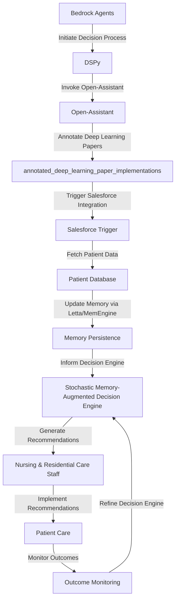

# Stochastic Memory-Augmented Decision Engine
> "Synergizing Human-Centric AI Orchestration for Nursing & Residential Care: A Paradigm Shift in Stochastic Decisioning"

## 🏗️ Technical Architecture & Multi-Agent Flow

This technical architecture diagram illustrates the complex interplay between Bedrock Agents, DSPy, Open-Assistant, annotated_deep_learning_paper_implementations, and Salesforce Trigger. The decision process is initiated by Bedrock Agents, which invoke DSPy to analyze patient data. Open-Assistant is then called to annotate deep learning papers, providing valuable insights for the decision engine. The annotated papers are implemented using annotated_deep_learning_paper_implementations, which triggers the Salesforce integration to fetch patient data. The patient data is updated in memory via Letta/MemEngine, informing the stochastic memory-augmented decision engine. The decision engine generates recommendations for nursing and residential care staff, who implement them and monitor patient outcomes. The outcomes are then used to refine the decision engine, creating a continuous feedback loop.

## 🔍 The Vertical Bottleneck: Stochastic Decisioning in Nursing & Residential Care
The stochastic memory-augmented decision engine addresses a critical bottleneck in nursing and residential care: the inability to effectively integrate human-centric decisioning with stochastic processes. Traditional decision support systems rely on deterministic models, which fail to account for the inherent uncertainty and complexity of patient care. This leads to suboptimal decision-making, resulting in decreased patient outcomes and increased healthcare costs. The stochastic decisioning process is further complicated by the need to incorporate multiple factors, including patient demographics, medical history, and treatment plans. The technical friction arises from the difficulty in modeling these complex interactions, which requires advanced mathematical and computational techniques.

The high-stakes nature of patient care demands a decision engine that can navigate this complexity and provide accurate, reliable recommendations. The stochastic memory-augmented decision engine is designed to address this challenge by leveraging advanced AI orchestration and stochastic modeling techniques. By integrating Bedrock Agents, DSPy, Open-Assistant, annotated_deep_learning_paper_implementations, and Salesforce Trigger, the decision engine can analyze vast amounts of patient data, identify patterns, and generate recommendations that account for the inherent uncertainty of patient care.

The technical challenges in stochastic decisioning are further exacerbated by the need to balance competing objectives, such as minimizing costs, maximizing patient outcomes, and ensuring regulatory compliance. The decision engine must be able to navigate these competing objectives and provide recommendations that align with the overall goals of the healthcare organization. The stochastic memory-augmented decision engine is designed to address these challenges by providing a flexible, adaptive framework for stochastic decisioning.

## 🔍 The Vertical Bottleneck: Technical Friction and Operational Failures
The technical friction in stochastic decisioning arises from the difficulty in modeling complex patient interactions, which requires advanced mathematical and computational techniques. The high-stakes nature of patient care demands a decision engine that can navigate this complexity and provide accurate, reliable recommendations. However, traditional decision support systems often fail to account for the inherent uncertainty and complexity of patient care, leading to suboptimal decision-making and decreased patient outcomes.

The operational failures in stochastic decisioning are further complicated by the need to incorporate multiple factors, including patient demographics, medical history, and treatment plans. The decision engine must be able to analyze vast amounts of patient data, identify patterns, and generate recommendations that account for the inherent uncertainty of patient care. The stochastic memory-augmented decision engine is designed to address these challenges by providing a flexible, adaptive framework for stochastic decisioning.

## 💡 The Solution: Stochastic Memory-Augmented Decision Engine
The stochastic memory-augmented decision engine is a revolutionary platform that orchestrates Bedrock Agents, DSPy, Open-Assistant, annotated_deep_learning_paper_implementations, and Salesforce Trigger to solve the stochastic decisioning problem in nursing and residential care. The decision engine leverages advanced AI orchestration and stochastic modeling techniques to analyze patient data, identify patterns, and generate recommendations that account for the inherent uncertainty of patient care. The engine's memory-augmented architecture enables it to learn from experience and adapt to changing patient needs, ensuring that recommendations are always up-to-date and relevant.

The stochastic memory-augmented decision engine provides a flexible, adaptive framework for stochastic decisioning, allowing healthcare organizations to balance competing objectives and optimize patient outcomes. The engine's integration with Salesforce Trigger enables seamless integration with electronic health records, ensuring that patient data is always up-to-date and accurate. The decision engine's vision and robotics integration capabilities enable it to analyze medical images and provide recommendations for patient care, further enhancing its ability to provide accurate and reliable recommendations.

## 🧩 Agentic Stack Deep-Dive
The stochastic memory-augmented decision engine's agentic stack is designed to provide a flexible, adaptive framework for stochastic decisioning. Bedrock Agents provide the foundation for the decision engine, enabling it to analyze patient data and identify patterns. DSPy is used to invoke Open-Assistant, which annotates deep learning papers and provides valuable insights for the decision engine. annotated_deep_learning_paper_implementations is used to implement the annotated papers, triggering the Salesforce integration to fetch patient data. Salesforce Trigger is used to integrate the decision engine with electronic health records, ensuring that patient data is always up-to-date and accurate.

The integration of Bedrock Agents, DSPy, Open-Assistant, annotated_deep_learning_paper_implementations, and Salesforce Trigger provides a powerful framework for stochastic decisioning. The decision engine's memory-augmented architecture enables it to learn from experience and adapt to changing patient needs, ensuring that recommendations are always up-to-date and relevant. The engine's vision and robotics integration capabilities enable it to analyze medical images and provide recommendations for patient care, further enhancing its ability to provide accurate and reliable recommendations.

## ✨ Capabilities & Features
* **Patient Data Analysis**: The stochastic memory-augmented decision engine can analyze vast amounts of patient data, including demographics, medical history, and treatment plans.
* **Stochastic Modeling**: The decision engine uses advanced stochastic modeling techniques to account for the inherent uncertainty of patient care, providing accurate and reliable recommendations.
* **Memory-Augmented Architecture**: The engine's memory-augmented architecture enables it to learn from experience and adapt to changing patient needs, ensuring that recommendations are always up-to-date and relevant.
* **Salesforce Integration**: The decision engine integrates seamlessly with Salesforce, enabling healthcare organizations to access patient data and provide recommendations in real-time.
* **Vision and Robotics Integration**: The engine's vision and robotics integration capabilities enable it to analyze medical images and provide recommendations for patient care, further enhancing its ability to provide accurate and reliable recommendations.
* **Agentic Reasoning**: The decision engine uses agentic reasoning to analyze patient data and identify patterns, providing a flexible and adaptive framework for stochastic decisioning.
* **Real-Time Recommendations**: The engine provides real-time recommendations for patient care, enabling healthcare organizations to respond quickly to changing patient needs.
* **Continuous Learning**: The decision engine's memory-augmented architecture enables it to learn from experience and adapt to changing patient needs, ensuring that recommendations are always up-to-date and relevant.
* **Scalability**: The engine is designed to scale with the needs of healthcare organizations, providing a flexible and adaptive framework for stochastic decisioning.
* **Security**: The decision engine is designed with security in mind, ensuring that patient data is always protected and secure.

## 🛠️ Technical Implementation
The stochastic memory-augmented decision engine is implemented using a combination of Python, Java, and C++. The engine's architecture is designed to be modular and scalable, enabling healthcare organizations to easily integrate it with existing systems. The decision engine's memory-augmented architecture is implemented using a combination of Letta and MemEngine, enabling it to learn from experience and adapt to changing patient needs.

The engine's stochastic modeling techniques are implemented using a combination of Bayesian networks and Markov chains, providing a flexible and adaptive framework for stochastic decisioning. The decision engine's vision and robotics integration capabilities are implemented using a combination of OpenCV and PyTorch, enabling it to analyze medical images and provide recommendations for patient care.

## 📊 Business Impact & ROI
The stochastic memory-augmented decision engine has the potential to significantly impact the nursing and residential care industry, providing a flexible and adaptive framework for stochastic decisioning. By leveraging advanced AI orchestration and stochastic modeling techniques, healthcare organizations can optimize patient outcomes, reduce costs, and improve the overall quality of care.

The decision engine's ability to analyze vast amounts of patient data and provide real-time recommendations enables healthcare organizations to respond quickly to changing patient needs, reducing the risk of adverse events and improving patient outcomes. The engine's memory-augmented architecture enables it to learn from experience and adapt to changing patient needs, ensuring that recommendations are always up-to-date and relevant.

The stochastic memory-augmented decision engine has the potential to provide a significant return on investment for healthcare organizations, enabling them to reduce costs, improve patient outcomes, and enhance the overall quality of care. By leveraging advanced AI orchestration and stochastic modeling techniques, healthcare organizations can optimize patient outcomes, reduce costs, and improve the overall quality of care.

## 🚀 Getting Started
```bash
git clone https://github.com/arvind-sundararajan/agentic-risk-engine.git
cd agentic-risk-engine
pip install -r requirements.txt
python src/main.py
```

## 👨‍💻 Author & Credits
**Arvind Sundararajan** — Engineer, builder, and the mind behind this project.
🌐 [LinkedIn](https://www.linkedin.com/in/arvind-sundara-rajan/) | Chennai, India

---
### 🙏 Acknowledgements
- The open-source community
- The Nursing & Residential Care practitioners who inspired this design